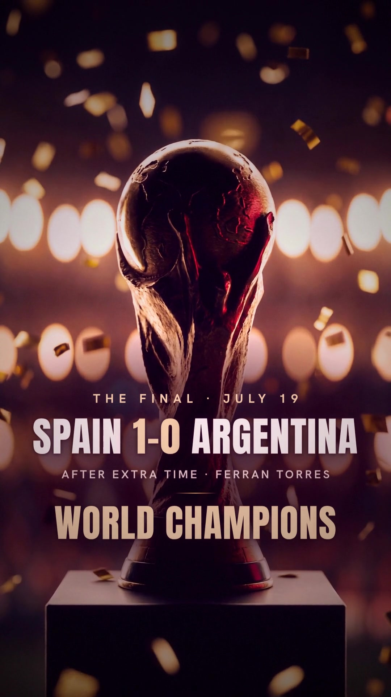

# Staff Challenge 26 — Instagram Recap Reel

A cinematic vertical recap of the office World Cup 2026 prediction pool.
Vertical 9:16, 1080×1920, ~25s, sound on.



- **Deliverable:** `StaffChallenge26_Recap.mp4` (H.264, 1080×1920, 30 fps, AAC stereo)
- **Reference score:** `score.mp3` (original, synthesized to picture — no licensing)
- **Poster / cover:** `poster.jpg`

## Concept

An "expensive title-sequence" treatment: near-black ink, antique-gold light,
atmospheric haze, slow premium camera pushes. No stock celebration clichés —
every shot is an original keyframe animated with a slow, locked move so it reads
like a graded film, not a template. The brand palette and type match the app
(Anton display, Hanken Grotesk, ink `#050507`, gold `#b49759`/`#e3d3a3`, cream
`#f4eee3`).

## Narrative (cold-open + 7 beats, each landing on a cut)

0. **Cold open** — 0.7s trophy punch-in → white-flash cut (hooks before the slow atmosphere)
1. **Hook** — stadium tunnel push → *"It's over. Six weeks · 104 matches"*
2. **Scale** — gold cards burst → *731 players · 40,332 predictions*
3. **The final** — trophy + confetti → *Spain 1–0 Argentina (AET, Ferran Torres) · World champions*
4. **The call** — one lit card among fallen ones → *Only 70 of 731 called Spain*
5. **Standings** — podium beam → *1 Rushdy Fowzer (388) · 2 Dane (384) · 3 cemcmldr (368)*
6. **Champion** — Maldives aerial → *Your 2026 champion: Rushdy Fowzer → the Maldives*
7. **End card** — Staff Challenge 26 · staffchallenge26.com

## Data provenance

All figures are pulled live from the pool's Supabase, not invented:

- 731 players (`kv` keys `wc:player:*`); 40,332 total predictions submitted.
- Final result + winning scorer from `wc:highlight` (k32, Final).
- 70 of 731 picked Spain as champion (`champ = 'Spain'`).
- Final standings computed by the app's own authoritative `standings()` RPC
  (the same scoring the live leaderboard uses; tiebreak pts → predicted → exact
  → correct → name): #1 Rushdy Fowzer (Retail Banking, 388), #2 Dane (Group IT,
  384), #3 cemcmldr (Group Compliance, 368). Winner Rushdy also picked Spain, so
  the "70 called it" bridge points straight at him.
- Prize (Maldives for #1) from the app's own OG copy.

## How it was built (pipeline)

Fully reproducible from `src/`:

1. **Keyframes** — Higgsfield `cinematic_studio_2_5`, 9:16, 2K, six original
   stills (tunnel, card-burst, trophy, lone card, podium, Maldives).
2. **Motion** — Higgsfield `cinematic_studio_3_0` image-to-video, 6s each, slow
   locked pushes with explicit anti-warp direction.
3. **Typography (animated)** — `src/cards.html` carries a deterministic JS
   animation engine (`renderFrame(beat,t,D)`): headlines mask-rise + fade,
   hero numbers count up (0→731, 0→40,332), text sits inside Instagram-safe
   margins. `src/capture.mjs` renders each beat to a transparent PNG **sequence**
   via headless Chromium (brand fonts, radial scrims for legibility over motion).
4. **Score** — `src/score.py` synthesizes an original cinematic bed (numpy +
   scipy reverb) scored to the exact cut: A-minor drone → relative-major lift on
   the trophy boom (7.0s) → tension pulse → warm C-major resolve, with impacts
   and shimmer on the beats.
5. **Assembly** — `src/build.py` trims/retimes each clip, burns in the faded
   overlays, xfades the beats, applies a unified grade (bloom + warm curves +
   vignette + fine grain), and muxes the score.

### Rebuild

```bash
# needs: ffmpeg, node + playwright-core, python3 (numpy, scipy), brand fonts
node src/capture.mjs     # render animated overlay PNG sequences (seq/<beat>/)
python3 src/score.py     # render score.wav (scored to the cut)
python3 src/build.py      # cold-open hook + composite + grade + mux -> final mp4
```

Raw 2K keyframes and 6s source clips are intentionally not committed (large and
regenerable); the prompts and job settings live in the generation history.
